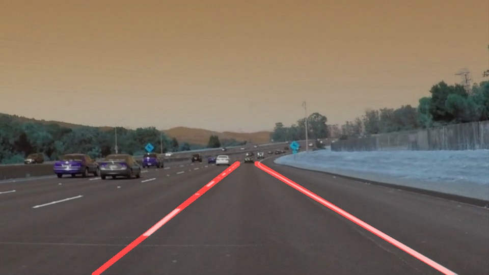
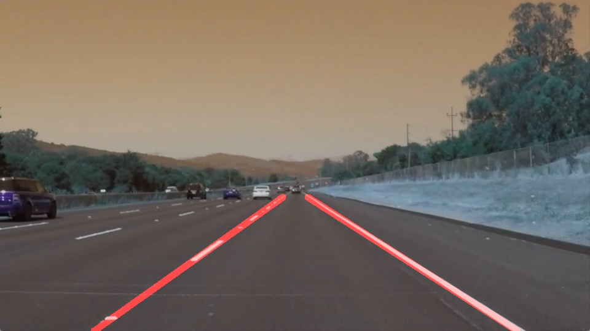
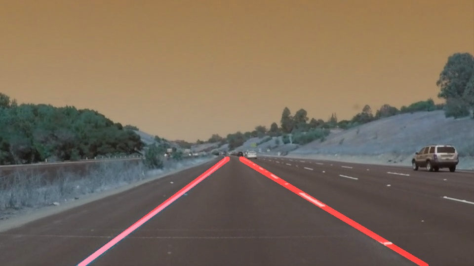
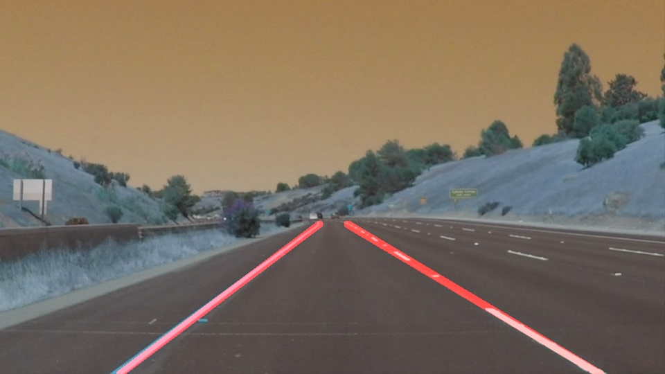
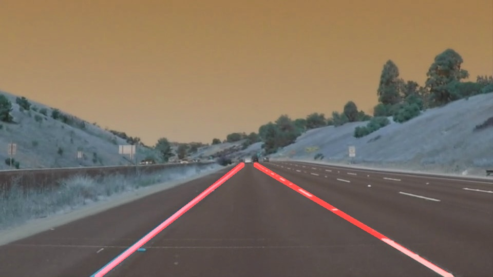

# **Finding Lane Lines on the Road** 

## Let's break it down!

---

This is the first project on the Self driving car nanodegree program at Udacity.
It helps to get out feet wet on the field of computer vision and also setting up us in a position to become a self driving car engineer in the future!

---

### Reflection

### Lane detection pipeline.

My pipeline consists of 5 steps. Steps will be explained below. 

* Color image is converted to grayscale image.
* Gaussian smoothing witht the kernel size of 3, before running canny (way of suppressing noise and spurious gradients by averaging).
* Obtaining edges by using cv2.Canny() with 80 , 250 being low and high thresholds.
* As it can be seen Lanes in the images are in the specific area. So I use hardcoded trapezoid region to mask out the region of interest. 
* Finally, using Hough transform to detect lines from the Canny edges. 

`Hardcoded values are experimented and optimized according to the obtained results`

This pipeline is ran on the test images and below images are the outputs. 

<table>
  <tr>
    <td>solidWhiteCurve</td>
     <td>solidWhiteRight</td>
     <td>solidYellowCurve</td>
  </tr>
  <tr>
    <td></td>
    <td></td>
    <td></td>
  </tr>
 </table>
 
 <table>
  <tr>
    <td>solidYellowCurve2</td>
     <td>solidYellowLeft</td>
     <td>whiteCarLaneSwitch</td>
  </tr>
  <tr>
    <td></td>
    <td></td>
    <td></td>
  </tr>
 </table>

Actually I spent more time on identifying the full extent of the lane where I needed to average and/or extrapolate the line segments to produce the same. 
collected the x-y coordinates of the mini lines into an array based on their slope. Then fit a straight line to these points. At this point the result was not stable at all frames for which I had to search for a better stabilized result. Later it was accomplished using the Robust linear model estimation using [RANSAC](https://scikit-learn.org/stable/auto_examples/linear_model/plot_ransac.html#sphx-glr-auto-examples-linear-model-plot-ransac-py) from [scikit-learn](scikit-learn.org)

### 2.Potential shortcomings with current pipeline

One potential shortcoming would be what would happen when the region of lane shifted significantly which could ultimately lead to the failure of the pipeline.

Another shortcoming could be hardcoding of too many parameters according to the given conditions in the image or the video stream, which cannot adapt videos taken in different conditions.

### 3. Suggest possible improvements to your pipeline

A possible improvement would be considering the curvy roads and making the pipeline robust so that it performs fairly in straight as well as curvy roads.

Another potential improvement could be adjusting region of interest according to the current position the vehicle is in by making use of HD Maps and Sensor fusion algorithms.
