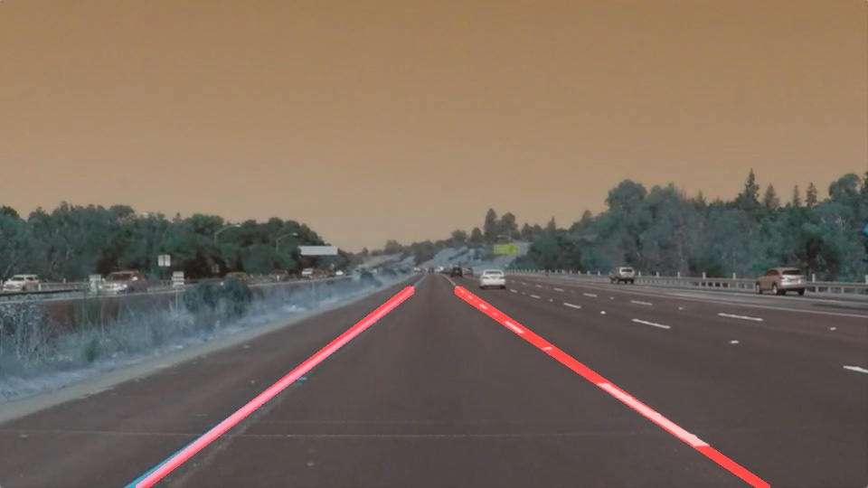

# **Finding Lane Lines on the Road** 

## Let's break it down!

---

This is the first project on the Self driving car nanodegree program at Udacity.
It helps to get out feet wet on the field of computer vision and also setting up us in a position to become a self driving car engineer in the future!

---

### Reflection

### Lane detection pipeline.

My pipeline consisted of 5 steps. Steps will be explained below. 

* Color image is converted to grayscale image.
* Gaussian smoothing witht the kernel size of 3, before running canny (way of suppressing noise and spurious gradients by averaging).
* Obtaining edges by using cv2.Canny() with 80 , 250 being low and high thresholds.
* As it can be seen Lanes in the images are in the specific area. So I use hardcoded trapezoid region to mask out the region of interest. 
* Finally, using Hough transform to detect lines from the Canny edges. 

`Hardcoded values are experimented and optimized according to the obtained results`

This pipeline is ran on the test images and below images are the outputs. 

<table>
  <tr>
    <td>solidWhiteCurve</td>
     <td>solidWhiteRight</td>
     <td>solidYellowCurve</td>
  </tr>
  <tr>
    <td></td>
    <td></td>
    <td></td>
  </tr>
 </table>
 
 <table>
  <tr>
    <td>solidYellowCurve2</td>
     <td>solidYellowLeft</td>
     <td>whiteCarLaneSwitch</td>
  </tr>
  <tr>
    <td></td>
    <td></td>
    <td></td>
  </tr>
 </table>

### 2. Identify potential shortcomings with your current pipeline

One potential shortcoming would be what would happen when ... 

Another shortcoming could be ...

### 3. Suggest possible improvements to your pipeline

A possible improvement would be to ...

Another potential improvement could be to ...
